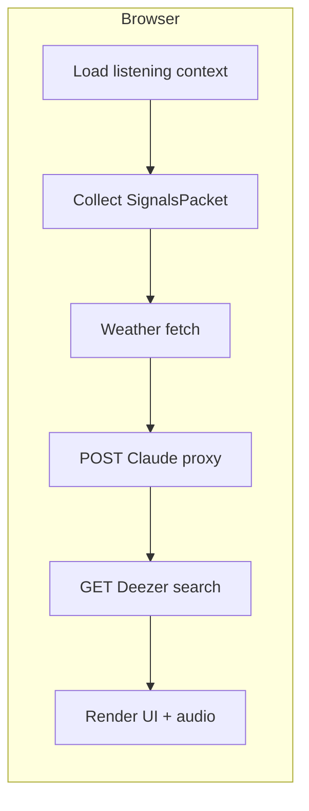

# VibeCheck — Detailed Technical Specification

**Version:** 1.3  
**Audience:** Engineers / agents implementing the hackathon build  
**Companion:** [`plan.md`](./plan.md) (concise narrative + feasibility). This file adds **contracts, prompts, endpoints, UI states, and acceptance tests**.

**One-hour single pass:** If you have **~60 minutes**, implement **only** §2.4; treat MVPs below as **Phase 2** unless marked included there. **Who does what:** see **§2.5** (default: **1 agent** for §2.4; **2 agents** for full MVP).

---

## Document map

| Section | Contents |
|---------|----------|
| [1](#1-summary) | Summary, thesis, personas |
| [2](#2-scope) | MVP vs stretch vs **§2.4–§2.5** (single-pass + agent model) |
| [3](#3-architecture) | Architecture & data flow |
| [4](#4-signals-collection) | Passive signals (implementation detail) |
| [5](#5-json-contracts--validation) | JSON contracts & validation rules |
| [6](#6-external-apis) | Weather, Claude, Deezer |
| [7](#7-ui-specification) | Screens, components, interaction states |
| [8](#8-notifications-demo-slice) | Notifications & demo-safe behavior |
| [9](#9-errors-empty-states) | Errors, retries, offline |
| [10](#10-security-privacy-compliance) | Security & privacy |
| [11](#11-non-functional-requirements) | Performance, observability |
| [12](#12-testing--demo-script) | Testing checklist & demo script |
| [13](#13-repository-layout-suggested) | Suggested repo layout |

---

## 1. Summary

### 1.1 Product

**VibeCheck** is a mobile-first web application that collects **passive environmental and behavioral signals** from the browser (time, coarse location optional, weather, idle/visibility hints, optional battery), plus **optional listening context** (primarily **on-device history** of previews played in-app; optionally **connected** Spotify / Last.fm after OAuth—stretch). It sends a structured **`SignalsPacket`** to **Claude**, receives a typed **`InferenceResult`** (mood framing + Deezer-optimized query + creative micro-nudge), and renders **real 30-second Deezer previews** so users can tap **Play** without typing mood or journaling.

### 1.2 Thesis (judges)

Other mood products ask users to translate feelings into inputs. **VibeCheck avoids explicit emotional labor** by inferring *context*, then offering **music + one small creative action**—supporting meaning-making without claiming clinical accuracy.

### 1.3 Personas

| Persona | Needs |
|---------|--------|
| **Ambient seeker** | Quick emotional regulation through sound; hates forms. |
| **Non-artist** | Wants permission + a tiny creative step; rejects “therapy app” vibes. |
| **Demo judge** | Sees passive signals → LLM → playable audio in under 10 seconds. |

---

## 2. Scope

### 2.1 MVP (must ship)

| ID | Requirement |
|----|----------------|
| **MVP-01** | On load, automatically run **one “read cycle”**: collect signals → Claude → Deezer → render UI. |
| **MVP-02** | **No mandatory user text input** for mood or journaling. Optional dev-only overrides allowed behind feature flag only. |
| **MVP-03** | Present **privacy notice** once (first visit), dismissible; store consent in `localStorage`. |
| **MVP-04** | Display **`notification_line`** as hero; **`weather_metaphor`**; **`mood_label`** + **`confidence`** (confidence may be visually subtle). |
| **MVP-05** | Show **4–8 Deezer tracks** where possible; prioritize tracks with **`preview`** URL; render HTML5 `<audio>` controls per track or single active player pattern. |
| **MVP-06** | Show **`creative_nudge`** and **`affirmation_line`**. |
| **MVP-07** | Provide **“Re-read the room”** control; debounce repeats (minimum 15 s between cycles unless forced dev reset). |
| **MVP-08** | If **`safety.distress_hint` is true**, render **minimal crisis resources panel** (non-diagnostic wording). |
| **MVP-09** | Maintain **`listening`** context: on each in-app preview play, append a capped FIFO entry to **`localStorage`** (see §4.2); merge into `SignalsPacket` each cycle; provide **Clear listening history** control. |

### 2.2 Stretch (nice-to-have)

| ID | Requirement |
|----|----------------|
| **STR-01** | In-app **toast/banner** styled like an OS notification with **Play preview**. |
| **STR-02** | **Web Notifications** permission; clicking notification focuses page and optionally auto-plays first preview. |
| **STR-03** | Periodic re-scan every **30–60 min** while tab visible / `document.visibilityState === 'visible'`. |
| **STR-04** | Extend model output with **`music_handoff`** URLs (Spotify / Apple Music / YouTube Music search URLs). |
| **STR-05** | Hourly pushes when site closed via **cron + Web Push** (requires backend). |
| **STR-06** | **Connect Spotify** (OAuth + backend) or **Last.fm** username import: attach **external** `recent_plays` / top artists into `SignalsPacket.listening` with `source: "spotify"` / `"lastfm"`. |

### 2.3 Non-goals

- Clinical diagnosis, therapy, crisis triage beyond static resources.
- Native iOS widgets, Screen Time, HealthKit.
- Guaranteed accuracy of inferred mood.

### 2.4 Single-pass MVP (~60 minutes)

**Verdict:** The **full** MVP table (MVP-01 … MVP-09) plus stretch items is **not** a reliable one-hour build. Use this subsection for **autonomous agents assigned a single session**.

| ID | Include (must finish) |
|----|------------------------|
| **SP-01** | Scaffold SPA + `.env.example` with `ANTHROPIC_API_KEY`; server-side Claude proxy only. |
| **SP-02** | Minimal `SignalsPacket`: time, timezone, day, locale, online, visibility, rough idle, mobile heuristic; `limitations` array. |
| **SP-03** | Weather via Open-Meteo **only** when geolocation resolves within ~5 s; else omit + token `weather_unavailable`. |
| **SP-04** | One Claude round-trip → validate `InferenceResult`; **stub** `listening` as `{ "source": "local_app", "recent_plays": [] }` **or** omit `listening`. |
| **SP-05** | Deezer search → show **4–6** preview-capable tracks + `<audio>` + link out. |
| **SP-06** | Loading UI + results UI + **Re-read** with **≥15 s** debounce + basic error state. |
| **SP-07** | Minimal privacy gate (short copy + Continue); store consent flag in `localStorage`. |
| **SP-08** | README with run instructions and limitation disclaimer. |

**Explicitly out of scope for SP-* (schedule Phase 2):** MVP-09 FIFO listening + Clear, STR Web Push / music_handoff / Spotify OAuth, scroll-click analytics, reverse geocode, distress UI unless trivial static link.

**Acceptance for SP-* (single go):** Cold load → privacy Continue → automatic read cycle → **at least one** Deezer preview plays → Re-read triggers second cycle without crash.

### 2.5 Agent execution model *(recommended defaults)*

This matches **[`plan.md`](./plan.md) §0.3**. Use it when launching multiple Cursor agents or splitting work across people.

| Goal | # Agents | Split |
|------|-----------|--------|
| **§2.4 single-pass** (~1 hr, minimum scope) | **1** | Single agent owns the full SP-01 … SP-08 vertical slice; no parallelization needed. |
| **Full MVP (MVP-01 … MVP-09) + demo polish** | **2** *(sweet spot)* | **Agent A (Platform & AI):** scaffold, `.env.example`, Claude proxy route, signal collection + weather path, `InferenceResult` validation, shared types/schemas. **Agent B (UI & product):** `App` flow, privacy gate, loading/result layouts, Deezer grid + `<audio>`, Re-read debounce, local listening FIFO + Clear, README/judge copy. |
| **Stretch** (OAuth, Web Push, handoff URLs) | **2** still, or **defer** | Add stretch only after MVP integration passes smoke test; third agent **not recommended** (coordination overhead). |

**Merge order:** Agent A merges **Claude proxy + exported types** first; Agent B branches from that and wires the client. Shared contract: **`SignalsPacket` / `InferenceResult`** in §5 (no duplicate definitions).

**Smoke test before “done”:** privacy → auto cycle → preview audio → optional Re-read → (if MVP-09) verify `localStorage` listening grows and Clear works.

---

## 3. Architecture

### 3.1 Logical flow



### 3.2 Deployment shapes

| Shape | When | Notes |
|-------|------|--------|
| **A. Dev proxy** | Recommended | Vite/Next API route holds `ANTHROPIC_API_KEY`; client calls `/api/claude`. |
| **B. Serverless** | Deploy demo | Single function forwards to Claude; same secret rules. |
| **C. User-pasted key** | Emergency | Local only; never commit; not for public deploy. |

**Rule:** Claude key must not ship in static client bundles.

### 3.3 Single “read cycle” pipeline

1. Generate `cycle_id` (UUID v4).
2. Build `SignalsPacket` + `limitations[]` for missing signals; attach **`listening`** from local storage and/or connected APIs (stretch).
3. Fetch weather (if lat/lon known) via Open-Meteo or OpenWeather.
4. `POST` `SignalsPacket` to Claude (see [6.2](#62-claude-messages-api)).
5. Validate `InferenceResult` (see [5](#5-json-contracts--validation)).
6. `GET` Deezer search with `deezer_search_query`; filter/sort tracks (see [6.3](#63-deezer-public-api)).
7. Render results; log timings.

---

## 4. Signals collection

### 4.1 Implementation checklist per signal

| Signal | Implementation notes |
|--------|---------------------|
| **Time** | `new Date().toISOString()`; `Intl.DateTimeFormat().resolvedOptions().timeZone`; local time from `Intl` or manual offset. |
| **Locale** | `navigator.language` |
| **Online** | `navigator.onLine` |
| **Mobile heuristic** | `navigator.userAgent` / `navigator.userAgentData?.mobile` if available |
| **Geolocation** | `navigator.geolocation.getCurrentPosition` with `enableHighAccuracy: false`, `maximumAge` 300000–600000 ms, `timeout` 10000 ms. If denied → `limitations.push("geolocation_denied")`. |
| **Reverse geocode** | Optional: call a public reverse geocode API **or** skip city and keep lat/lon only for weather. City is optional. |
| **Weather (no key)** | **Open-Meteo** `https://api.open-meteo.com/v1/forecast?latitude={lat}&longitude={lon}&current=temperature_2m,weather_code,wind_speed_10m` — map `weather_code` to coarse `condition` enum: `clear` / `cloud` / `rain` / `snow` / `storm` / `fog` / `unknown`. |
| **Weather (key)** | OpenWeather One Call / Current — keep server-side key if used. |
| **Visibility** | `document.visibilityState` |
| **Idle estimate** | Maintain last interaction timestamp from `pointerdown`, `keydown`, `scroll` (debounced). `idle_ms_estimate = now - lastInteraction`. |
| **Scroll/clicks (lightweight)** | Optional counters in sliding 5-minute window for “restless vs still” hints; low priority if time constrained. |
| **Battery** | `navigator.getBattery?.()` if exists; else `limitations.push("battery_api_unavailable")`. |

### 4.2 Listening history

#### A. Local in-app history (MVP-09)

| Rule | Detail |
|------|--------|
| **Trigger** | On `audio` **play** or **ended** (or `timeupdate` when `currentTime > 3s` to count a “real” listen—pick one rule and stay consistent). |
| **Payload** | `deezer_track_id`, `title`, `artist_name`, `played_at_iso`, optional `genres[]` from Deezer track payload if available, optional `play_ratio` (how much of preview listened). |
| **Storage** | `localStorage` key e.g. `vibecheck_listening_v1` — JSON array, **FIFO cap** 24–40 entries. |
| **Anti-spam** | Dedupe same `deezer_track_id` within 10 minutes (update timestamp only). |
| **Cold start** | If empty → `limitations.push("listening_cold_start")` (optional token) and send `listening.recent_plays: []`. |

#### B. Connected services (STR-06)

| Provider | API | Notes |
|----------|-----|--------|
| **Spotify** | Web API: recently played, top tracks/artists | Requires OAuth; **client secret** must live **server-side**; merge normalized entries into `listening.recent_plays` with `source: "spotify"`. |
| **Last.fm** | `user.getRecentTracks` | API key server-side; user supplies Last.fm username; lighter integration. |

**Merge precedence:** If both local and Spotify exist, include both under `listening.recent_plays` with `source` field on each item **or** split arrays—pick one schema (recommended: single array with `source` enum per row).

#### C. Downstream use

- **Claude:** Biases `deezer_search_query` toward **adjacency** (new genres / moods next to taste) and avoids repeating the **exact** prior query string when possible.
- **Deezer selection:** Optionally **deprioritize** tracks whose `(artist, title)` match a recent play (same session).

### 4.3 `SignalsPacket` merge rules

- Always set `collected_at_iso`.
- Append unknown limitations rather than failing the cycle.
- Never block the cycle solely because geo was denied; continue with time-only context.
- Always attach **`listening`** object; use empty `recent_plays` when cold start.

---

## 5. JSON contracts & validation

### 5.1 `SignalsPacket`

**Required top-level keys:** `collected_at_iso`, `limitations` (array, may be empty).

**Recommended keys:** `timezone`, `local_time_24h`, `day_of_week`, `locale`, `device`, `behavior`, **`listening`**.

**Optional nested objects:** `geo`, `weather`.

#### `listening` object

| Field | Type | Notes |
|-------|------|--------|
| `source` | string | `"local_app"` \| `"mixed"` \| `"spotify"` \| `"lastfm"` — how rows were gathered |
| `recent_plays` | array | Recent items (most recent first); each item includes at least `title`, `artist_name`, `played_at_iso`; optional `deezer_track_id`, `genres`, `source`, `play_ratio` |
| `aggregate_hint` | object | Optional tiny derived stats for the model: `top_genres[]`, `notes` (leave empty string if none) |

#### Enums / formats

| Field | Type | Constraint |
|-------|------|------------|
| `collected_at_iso` | string | ISO-8601 |
| `local_time_24h` | string | `HH:mm` 24h |
| `limitations[]` | string[] | Known tokens below |

**Known `limitations` tokens:** `geolocation_denied`, `geolocation_timeout`, `weather_unavailable`, `battery_api_unavailable`, `online_false`, `listening_cold_start`, `listening_external_unavailable`.

### 5.2 `InferenceResult`

**Required keys:**

| Key | Type | Constraints |
|-----|------|----------------|
| `mood_label` | string | 2–6 words preferred |
| `confidence` | number | `0 <= x <= 1` |
| `weather_metaphor` | string | Non-clinical metaphor |
| `notification_line` | string | ≤ 120 chars; evocative; not diagnostic |
| `deezer_search_query` | string | **3–8 tokens**, comma or space separated OK; genre/mood/instrument biased; ASCII preferred; should **vary** when `listening.recent_plays` suggests repetition (adjacent genres / complementary mood) |
| `playlist_title` | string | Original title (no trademarked playlist names) |
| `playlist_vibe` | string | 2–4 sentences max |
| `creative_nudge` | string | One tiny action, ≤ 220 chars |
| `affirmation_line` | string | One sentence, non-sappy |
| `safety` | object | Must include `distress_hint` boolean |

**Optional key:** `music_handoff` (object) for stretch goals.

```json
{
  "music_handoff": {
    "primary_query": "string",
    "spotify_url": "https://open.spotify.com/search/...",
    "apple_music_url": "https://music.apple.com/search?term=...",
    "youtube_music_url": "https://music.youtube.com/search?q=..."
  }
}
```

### 5.3 Validation failure handling

If JSON parse fails or validation fails:

1. Retry once with same `SignalsPacket` and append system instruction: “Previous output failed validation; output valid JSON only.”
2. If still failing, show user-friendly error with **generic fallback copy** and offer **Re-read**; log raw model output to console in dev only.

---

## 6. External APIs

### 6.1 Open-Meteo (recommended default)

**Example:**

```http
GET https://api.open-meteo.com/v1/forecast?latitude=40.44&longitude=-79.99&current=temperature_2m,weather_code,wind_speed_10m
```

**Map** `weather_code` per Open-Meteo WMO documentation into simplified `condition` for Claude.

### 6.2 Claude (Messages API)

**Transport:** HTTPS `POST` from **server-side proxy** to `https://api.anthropic.com/v1/messages` (or current Anthropic endpoint per docs).

**Headers:** `x-api-key`, `anthropic-version`, `content-type: application/json`.

**Request body (conceptual):**

```json
{
  "model": "<fast-model>",
  "max_tokens": 1024,
  "temperature": 0.6,
  "system": "<SYSTEM_PROMPT>",
  "messages": [
    { "role": "user", "content": "<SignalsPacket JSON string>" }
  ]
}
```

Use **`response_format` JSON** if supported by the chosen SDK/model combination; otherwise enforce JSON-only via system prompt + extract first JSON object from text.

#### System prompt (single-call MVP — draft)

Requirements embedded for the model:

- You receive only passive environmental signals—not user medical data.
- You are **not** a clinician; avoid diagnosing mental illness.
- Output **only** JSON matching `InferenceResult` schema (list keys explicitly in prompt).
- `deezer_search_query` must be optimized for music **keyword search**, not prose.
- `notification_line` must not claim certainty (“you are depressed”) — use tentative, humane language (“feels like…”, “a night for…”).
- Set `safety.distress_hint` true **only** if signals strongly imply imminent self-harm language — **with no user text this should almost always be false**.
- If `SignalsPacket.listening.recent_plays` is non-empty: use it to steer recommendations toward **novelty-within-comfort** (adjacent genres, complementary mood), not identical keywords every cycle; never invent tracks not implied by data.
- If listening is empty (cold start): rely on passive environmental signals only.

### 6.3 Deezer (public API)

**Search tracks:**

```http
GET https://api.deezer.com/search/track?q=<URL_ENCODED_QUERY>&limit=25
```

**Selection algorithm (MVP):**

1. Take first `data[]` items that include non-empty `preview`.
2. Target **6** tracks; minimum **3** if previews scarce.
3. Dedupe by `(artist.name + title)` case-insensitive.
4. If `< 3` previews, broaden query once by appending genre term from mood (deterministic mapping in code, not LLM—avoid extra latency).
5. Optionally sort down tracks that duplicate **recent** `(artist_name, title)` from `listening.recent_plays` when building the grid.

**Rendering:**

- Show `title`, `artist.name`, `album.cover_small` or `cover_medium` if present.
- Use `preview` URL in `<audio controls>` or custom player.
- Link `link` for “Open in Deezer”.

---

## 7. UI specification

### 7.1 Visual language

- **Dark**, calm background; **one** accent derived from mood (optional: derive hue from hash of `mood_label` only for subtle accent—not clinical color coding).
- **Large tap targets** (min ~44px).
- Avoid clinical icons (no syringes, no EEG metaphors).

### 7.2 Screens / states

| State | Description |
|-------|-------------|
| **Privacy** | First-run modal; “Continue” enables app. |
| **Collecting** | Ambient animation + **signal checklist** dots (weather/geo/etc.). |
| **Ready** | Transition automatically to inference—no extra user tap unless geo permission needed (then inline prompt). |
| **Playing** | Optional: single active preview; stop others when one plays. |
| **Error** | Friendly failure + Retry. |

### 7.3 Component list (suggested)

| Component | Responsibility |
|-----------|----------------|
| `PrivacyNotice` | One-time consent |
| `SignalPulse` | Collecting animation + status chips |
| `VibeHero` | `notification_line`, `weather_metaphor` |
| `MoodChip` | `mood_label`, `confidence` |
| `PlaylistStory` | `playlist_title`, `playlist_vibe` |
| `TrackGrid` | Deezer results + audio; **emit play events** to listening logger |
| `ListeningLogger` | Hook on `<audio>` events → update `localStorage` FIFO |
| `CreativeFooter` | `creative_nudge`, `affirmation_line` |
| `ReReadButton` | Trigger new cycle |
| `ClearListeningButton` | Clears on-device listening history (privacy) |
| `ConnectMusic` *(stretch)* | Spotify / Last.fm connect UX |
| `DistressPanel` | Static resources if `distress_hint` |

### 7.4 Accessibility

- Visible focus rings on interactive elements.
- `prefers-reduced-motion`: disable heavy motion.
- Adequate contrast for body text (WCAG AA target where feasible during hackathon).

---

## 8. Notifications & demo slice

### 8.1 Web Notifications (stretch)

- Request permission **after first successful cycle** (better conversion than on landing).
- Payload: title “VibeCheck”, body = `notification_line`.
- On `notificationclick`: focus window, optionally call `playFirstPreview()`.

### 8.2 Honest limitations (README)

- Web cannot guarantee Spotify-style playback **inside** the notification shade for third-party catalogs.
- Deezer previews play **inside the web app**; this is the demo-realistic “Play” proof.

---

## 9. Errors & empty states

| Situation | UX |
|-----------|-----|
| Offline at load | Explain offline; Retry when online |
| Geo denied | Proceed without weather or use IP-geolocation **only if** ethically acceptable for demo—default to proceed without |
| Weather fetch failed | Continue; `limitations` includes `weather_unavailable` |
| Claude failure | Retry once; then error card |
| Deezer empty results | Fallback query = `deezer_search_query` + `"ambient"` / `"instrumental"` deterministic suffix |
| No previews | Show tracks without audio + apology line |

---

## 10. Security & privacy

- No accounts in MVP; no PII collection **except** optional OAuth identifiers if STR-06 ships—disclose in privacy copy.
- **Local listening history** is user-controlled data; provide **Clear**; avoid syncing to server unless user opts in.
- Do not persist raw signals server-side unless explicitly disclosed.
- Avoid logging full IP in client analytics.
- Rate-limit proxy endpoint if exposed publicly (prevent key drain).

---

## 11. Non-functional requirements

| Metric | Target |
|--------|--------|
| Cold demo path | ≤ 10 s on decent mobile LTE |
| Claude proxy latency | Log `t_claude_ms` |
| Deezer latency | Log `t_deezer_ms` |
| Bundle | Keep lightweight for hackathon |

---

## 12. Testing & demo script

### 12.1 Manual test checklist

- [ ] Fresh load → privacy → auto cycle completes.
- [ ] Geo denied path still completes.
- [ ] Airplane mode triggers offline UI.
- [ ] At least one preview plays audio on iOS Safari.
- [ ] After 2–3 plays, next cycle’s `deezer_search_query` / grid **does not** identical-repeat the previous suggestion (listening-aware).
- [ ] Clear listening history resets stored plays.
- [ ] Re-read debounce works.
- [ ] Distress panel appears if forced via dev flag / rare model output.

### 12.2 Judge demo script (≈90 seconds)

1. **Problem:** Emotional apps demand explicit inputs; that friction blocks access.
2. **Show landing:** No mood form — “reading the room.”
3. **Reveal signals collected** (dots): time, weather/limits, visibility.
4. **Show Claude output:** metaphor + suggestion line + creative nudge.
5. **Tap Deezer preview:** audio plays — “LLM chooses the doorway; music is the proof.”
6. **Close:** Responsible boundaries — contextual inference, not diagnosis; future native/push roadmap.

---

## 13. Repository layout (suggested)

```
/apps/web                 # Vite + React (example)
/apps/web/src/lib/signals.ts
/apps/web/src/lib/claude.ts
/apps/web/src/lib/deezer.ts
/apps/web/api/claude.ts   # server route (if Next) OR vite plugin middleware
/spec.md                   # copy of this doc or symlink
/plan.md                   # product + feasibility companion
```

---

## Appendix A — `music_handoff` URL construction

- Percent-encode queries with `encodeURIComponent`.
- Prefer **search** URLs over fabricating track IDs.
- Label UI: “Open in Spotify / Apple Music / YouTube Music (search)”.

---

## Appendix B — Cycle debounce

- `last_cycle_at` timestamp in memory; block Re-read if `< 15 s` unless `DEBUG=true`.

---

**End of specification.**
